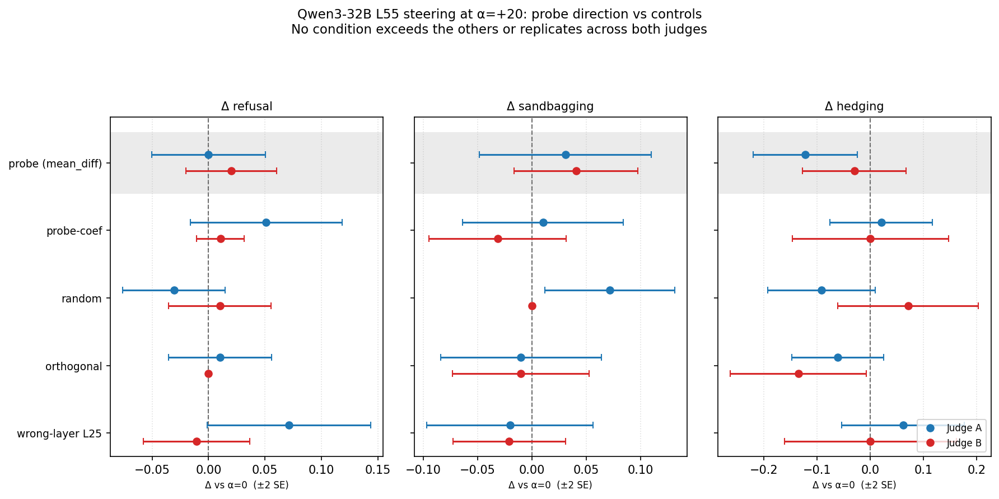

# alignment-evals

Empirical research on evaluation awareness and safety-relevant signals in language models.

## Current Paper

### Probing Is Not Enough: Eval/Deploy Directions Are Decodable but Not Causally Sufficient for Behavior

**Status: submitted to TMLR (OpenReview) on 2026-06-18 — under double-blind review.**

[Paper PDF](docs/probing-is-not-enough.pdf)

Linear probes can distinguish evaluation prompts from deployment-style prompts in residual-stream activations across two open-weight reasoning models. The key question is whether the recovered direction is behaviorally meaningful under intervention.

| Model | Architecture | Peak probe layer | Cross-distribution AUROC |
| --- | --- | ---: | ---: |
| Qwen3-32B | Dense decoder | L55 | **0.917** |
| gpt-oss-120b | Sparse MoE | L34 | **0.896** |

On Qwen3-32B at L55, steering the probe-recovered direction did not produce effects on refusal, sandbagging, or hedging that were detectably larger than equal-magnitude random, orthogonal, or wrong-layer interventions. Surface text changed under all steering directions, but not in a probe-specific behavioral pattern.

**Conclusion:** probe recoverability is evidence that eval/deploy information is linearly encoded. It is not, by itself, evidence that the recovered direction is causally sufficient for behavior.

**Scope:** the full matched-control steering comparison is complete for Qwen3-32B at L55. The gpt-oss-120b experiments establish cross-architecture decodability and a corroborating probe-direction steering null, but do not include the full matched-control suite. The paper tests sufficiency under single-layer additive steering, not all forms of causal relevance or operational monitoring usefulness.

## V4 Implementation

[Methodology](v4/METHODOLOGY_v2.md) | [Scripts](v4/scripts/) | [Figures](docs/figures/)

Reproduction requires open model weights, benchmark prompts from their original sources, and GPU inference. Raw prompt-bearing rollouts and activation files are not redistributed. The paper reports the aggregate results and inference stack in detail.

## Earlier Studies: Prompt And Trace-Level Eval Awareness

The earlier V1-V3 studies examine whether evaluation-related prompt cues change visible behavior and whether explicit mentions in reasoning traces track those changes.

| Study | Question | Main result | Artifact |
| --- | --- | --- | --- |
| V1 | Does explicit evaluation framing change behavior and verbalized eval awareness? | Safety refusal shifted in opposite directions for Opus and qwen3 on prompts where neither verbalized the evaluation. A pre-registered qwen3 mediation replication returned null. | [`docs/paper_draft.md`](docs/paper_draft.md) |
| V2 | Do prompts intrinsically labeled as evaluation-like predict behavior? | Eval-labeled prompts predicted higher refusal across six models; five of six effects survived correction. | [`docs/paper.pdf`](docs/paper.pdf) |
| V3 | Is the explicit framing effect attributable to one clause? | No singleton clause survived correction; the active-model pattern was compatible with distributed contributions. | [`docs/paper.pdf`](docs/paper.pdf) |

Public summary: [The Prompt Is the Tell, Not the Reasoning Trace: Eval Awareness](https://medium.com/@ratnaditya/the-prompt-is-the-tell-not-the-reasoning-trace-eval-awareness-241287e9ac70)

These studies motivate the activation-level paper but do not subsume it. V1-V3 evaluate prompts, behavior, and text-level reasoning traces. V4 tests internal activation signals with controlled interventions.

## Repository Layout

| Path | Contents |
| --- | --- |
| [`docs/`](docs/) | Papers, public write-ups, figures, and pre-registration documents |
| [`v4/`](v4/) | Activation-level probing and steering study |
| [`scripts/`](scripts/) | Paper and figure build utilities |

## Contact

Ratnaditya Jonnalagadda, [ratnaditya@gmail.com](mailto:ratnaditya@gmail.com)

## License

MIT
