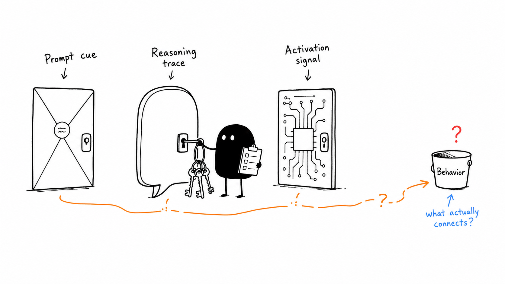
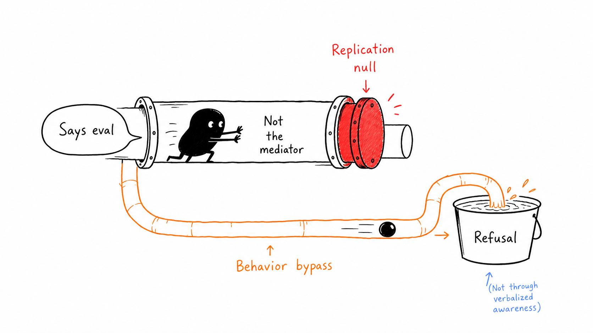
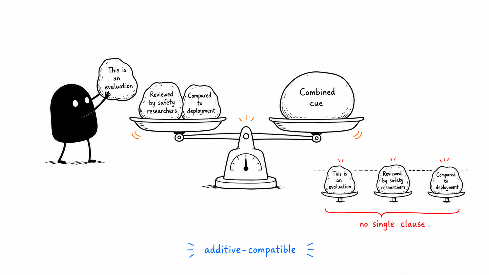
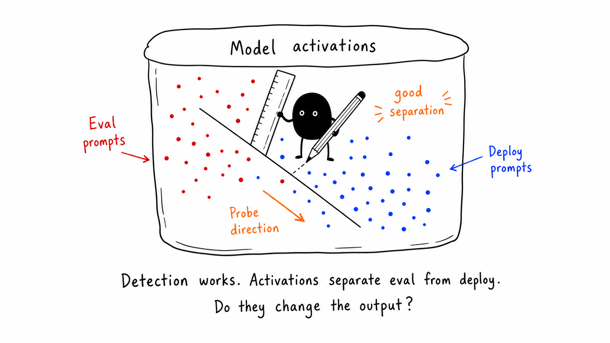
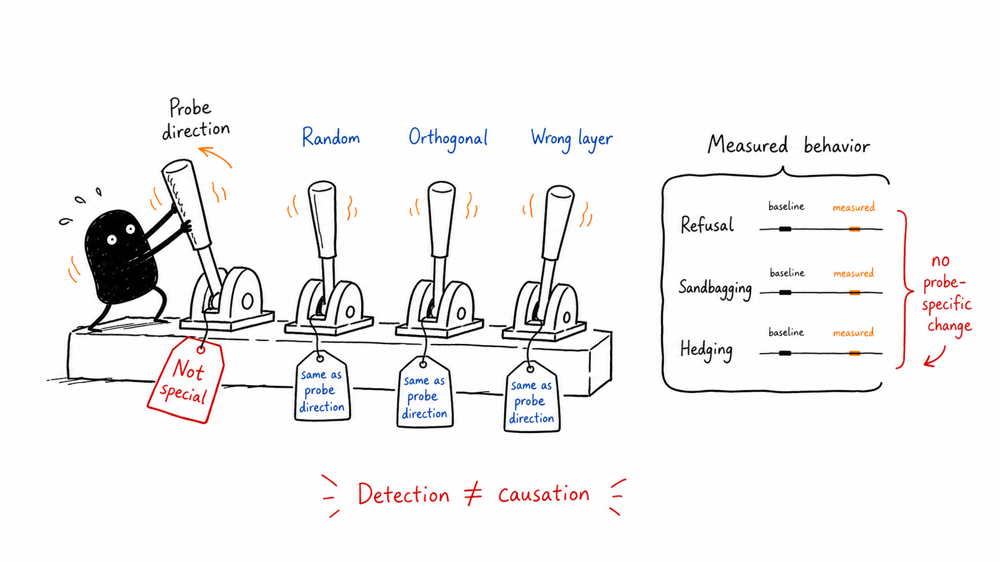

# Eval-Awareness Research, Illustrated

This page gives a quick visual path through the two papers:

- [The Prompt Is the Tell, Not the Reasoning Trace](paper.pdf)
- [Probing Is Not Enough](probing-is-not-enough.pdf)

The main story is: eval-related signals can be detected in prompts, reasoning traces, and activations, but detection is not the same thing as a behavioral mechanism.

## 1. Three Signal Surfaces

The research separates three places where an eval-related signal might appear: the prompt, the reasoning trace, and model activations. The key question is which, if any, actually connects to behavior.

## 2. Verbalization Is Not the Mediator

Models can sometimes say or imply that a prompt looks like an evaluation. But the replicated mediation test does not support verbalized eval-awareness as the route through which refusal behavior changes.

## 3. Hidden Label on the Prompt

In V2, Apollo's intrinsic eval-labeled prompts predicted higher refusal across the model lineup. The important point is that the signal lives in the prompt content or format itself, before adding any explicit eval-framing text.

## 4. Activations Separate Eval From Deploy

In the activation-level paper, residual-stream activations contain a decodable eval/deploy signal. A linear probe can separate activation points from eval-framed and deploy-framed prompts.

That sets up the next question: if the signal is detectable, does steering that signal change model output?

## 5. Detection Is Not Causation

The causal steering test compares the probe direction with matched controls: random, orthogonal, and wrong-layer interventions. The probe direction is not behaviorally special relative to those controls.

## Appendix: Three Clause Detail

This image is a follow-up detail for V3. The explicit inject prompt was split into three clauses. No single clause carried the refusal-rate shift by itself; the result was additive-compatible, meaning the combined cue looked more like accumulated framing weight than one magic phrase.

